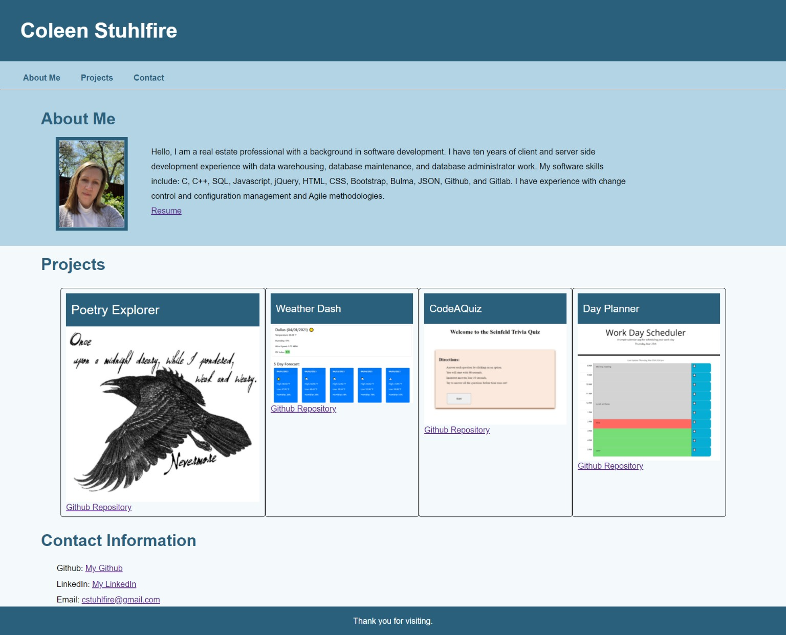

# Portfolio

## Description
This is a profile demonstrating my technical skills in HTML, CSS, and Javascript. There are links to my resume, github repository, and linkedin profile. The included projects are described below.

## Poetry Explorer
This application presents users with a dashboard in which they can search for poetry by author or title. They can then select words within the poem to get definitions. Definitions are displayed at the bottom of the screen and searched words are maintained in a list to act as a vocabulary builder. Technologies used: Javascript, HTML, CSS.

## Weather Dash
This application presents users with a weather dashboard. They can search by city and the current weather and a five day forecast is displayed. A list of recently searched cities is stored so that users can easily retrieve their recent searches. Technologies used: Javascript, HTML, CSS.

## CodeAQuiz
This application is a Seinfeld trivia quiz. Users are give 60 seconds and are challenged to answer trivia questions before time runs out. Ten seconds are lost for each incorrect answer. Users can save their high score. Technologies used: Javascript, HTML, CSS.

## Day Planner
This application is provides a view into a user's daily schedule. The days events are entered and displayed in one hour time blocks. The current hour is highlighted red, past hours are grey, and future time blocks are green. Technologies used: Javascript, HTML, CSS.

## Website Screenshot

## Link to Deployed Application
[Deployed Application](https://cstuhlfire.github.io/Portfolio/)
## Link to Gitbub
[Link to Github Repository](https://github.com/cstuhlfire/Portfolio)

## **
